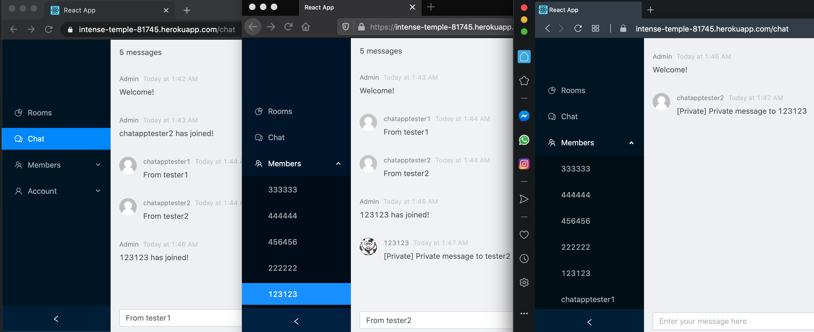

# React Chat App

This is a React chat App

## Login Credentials
URL: https://intense-temple-81745.herokuapp.com __(The server is down from 5am - 11am GMT)__

Notes:
* You can only open one session in each browser
* Sample chat room
    * 3 (The name is just 3, no password)
* Tester accounts:
    * chatapptester1 (password: testerpwd1)
    * chatapptester2 (password: testerpwd2)
* Error messages to be done. Currently, if 
there are no effects after clicking a certain button,
it means the operation is not permitted
(for example, registering with duplicated username or joining a non-existing room)

## Features
**Administration of user created chat rooms:**
  - Users can create chat rooms with an arbitrary room name
  - Users can join an arbitrary chat room 
  - Users can leave a chat room
  - The chat room displays all users currently in the room
  - A private room can be created that is password protected

**Messaging:**
  * A user's message shows their username and is sent to everyone in the room
  * Users can send private messages to another user in the same room (click the username in the 'Members' dropdown menu)
  * Users have avatars (Gravatar library: grab avatar linked with the registration email)
  * Message shows time
  
**Other features**
* Real-time updates using React (this includes the messages, the list of users in room etc.)
* JSON web tokens are stored in local storage, so the session is kept even if the user closes the tab. This also means that users can only start one session in one browser
* Mobile-friendly
* When a new user joins, or an existing user leaves, there will be a message in the chatroom

## Screenshots

  
